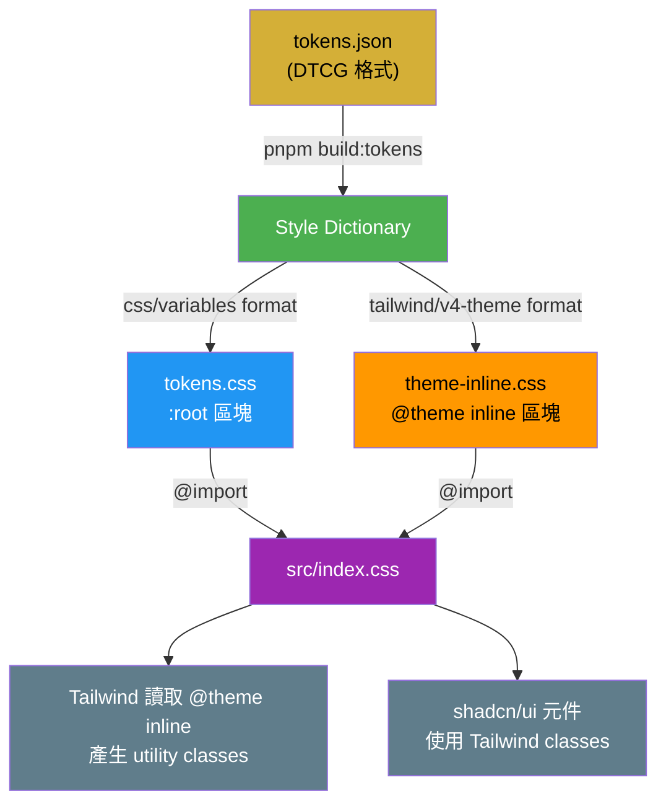
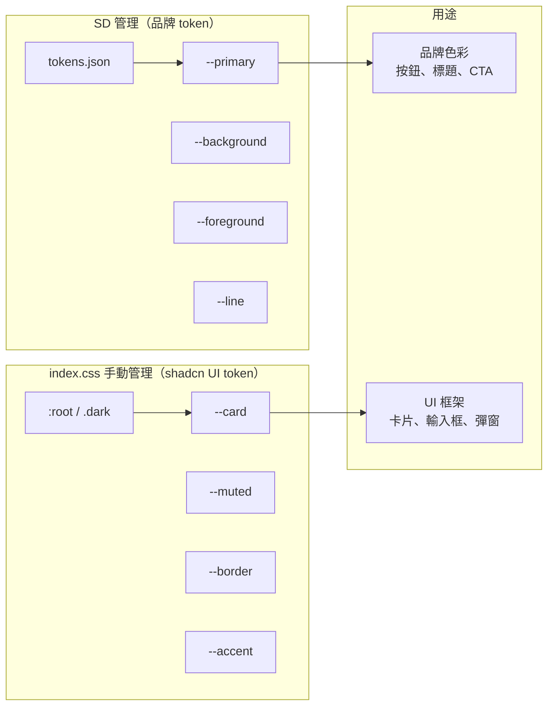
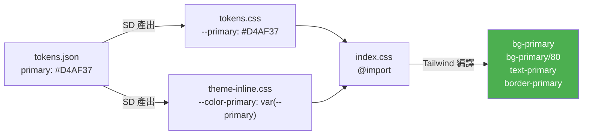
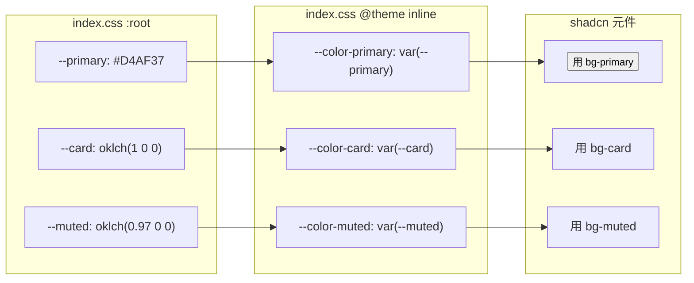
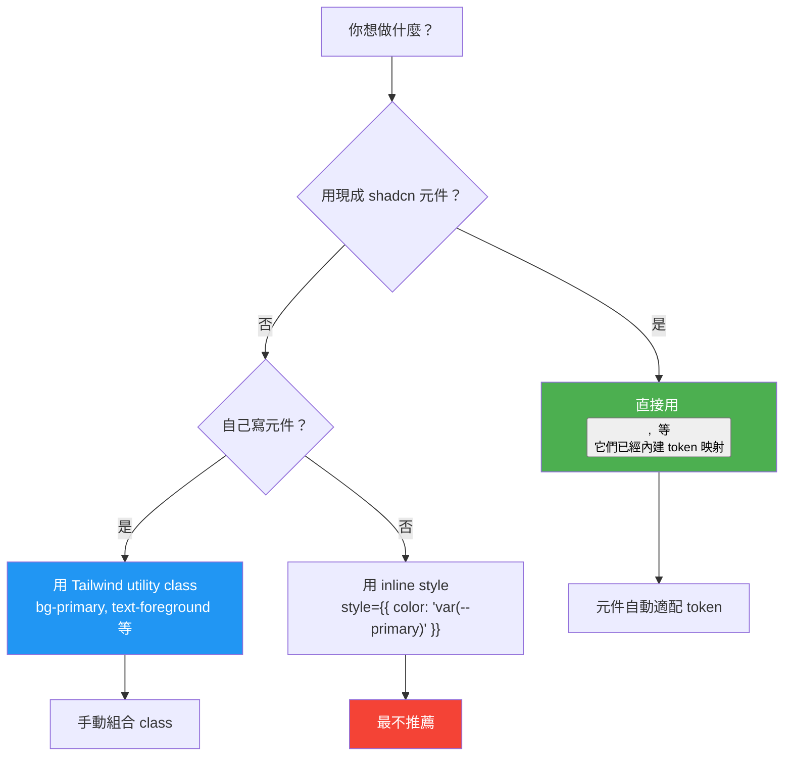
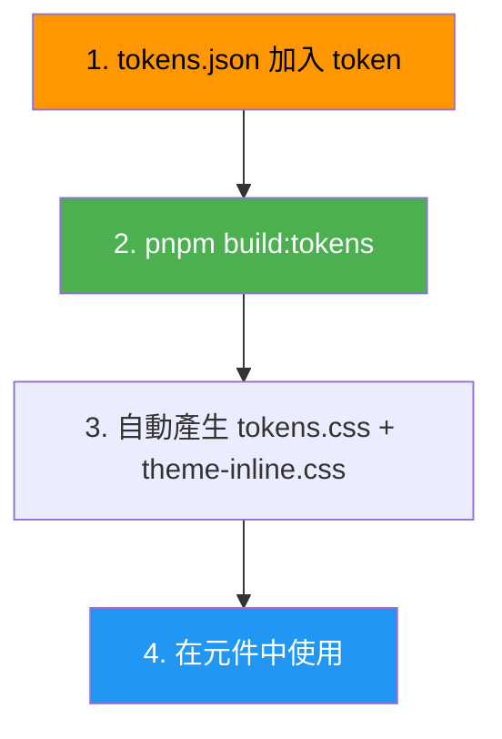
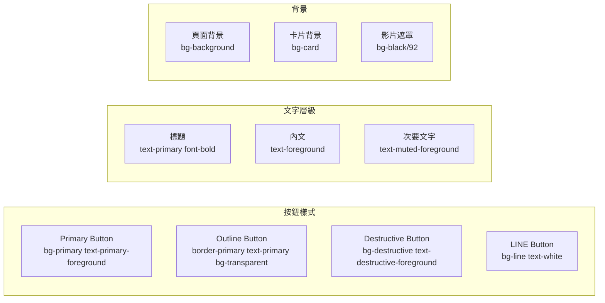
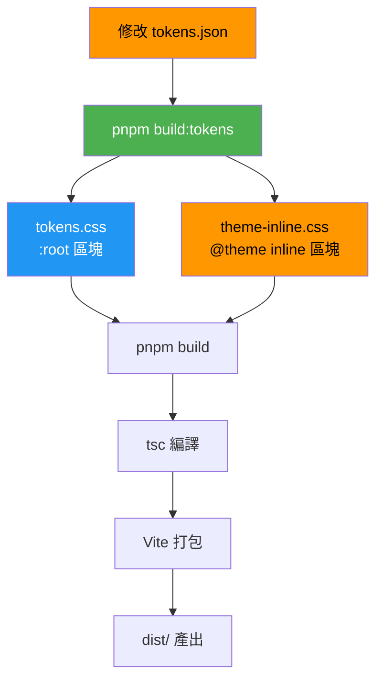

# Design Token 使用指南

## 架構總覽



## 兩套系統的分工

本專案有兩套 CSS 變數系統，各自負責不同層級：



| | SD 管理（品牌 token） | index.css 手動管理（shadcn UI token） |
|---|---|---|
| **定義位置** | `src/config/tokens.json` | `src/index.css` 的 `:root` / `.dark` |
| **包含** | `primary`, `background`, `foreground`, `line` | `card`, `muted`, `accent`, `border`, `destructive` 等 |
| **產生方式** | SD 自動產生 `tokens.css` + `theme-inline.css` | 手動寫在 `index.css` |
| **改動方式** | 改 `tokens.json` → 跑 `pnpm build:tokens` | 直接改 `index.css` |
| **適用場景** | 品牌色彩、產品色系 | UI 框架層級的通用色 |

## Tailwind 怎麼用

Tailwind v4 透過 `@theme inline` 區塊認識 CSS 變數，產生 utility classes。

### 流程



### 使用方式

```tsx
// 背景色
<div className="bg-primary">...</div>
<div className="bg-primary/80">...</div>  // 80% 透明度

// 文字色
<h1 className="text-primary">...</h1>
<p className="text-foreground">...</p>
<p className="text-foreground/70">...</p>  // 70% 透明度

// 邊框色
<button className="border border-primary">...</button>
<div className="border-t border-line">...</div>
```

### 透明度 modifier

Tailwind v4 支援 `/` 語法調整透明度：

```tsx
bg-primary       // 100%
bg-primary/80    // 80%
bg-primary/50    // 50%
bg-primary/10    // 10%
```

## shadcn/ui 怎麼用

shadcn 元件使用 Tailwind utility classes 來套用 token。shadcn 的元件（如 `Button`, `Card`）已經內建了 token 映射。

### 流程



### 使用方式

```tsx
import { Button } from "@/components/ui/button"
import { Card, CardContent } from "@/components/ui/card"

// Button 自動使用 --primary 色
<Button>主要操作</Button>

// Card 使用 --card 色
<Card>
  <CardContent>卡片內容</CardContent>
</Card>

// 自訂元件也可以用 Tailwind class
<div className="rounded-lg border border-border bg-card p-4">
  <h3 className="text-lg font-semibold text-card-foreground">標題</h3>
  <p className="text-sm text-muted-foreground">內文</p>
</div>
```

### shadcn 元件用到的 token

| Token | 用途 | Tailwind Class |
|-------|------|---------------|
| `--primary` | 主要按鈕、強調色 | `bg-primary`, `text-primary` |
| `--primary-foreground` | primary 上的文字 | `text-primary-foreground` |
| `--background` | 頁面背景 | `bg-background` |
| `--foreground` | 主要文字 | `text-foreground` |
| `--card` | 卡片背景 | `bg-card` |
| `--card-foreground` | 卡片文字 | `text-card-foreground` |
| `--muted` | 次要背景 | `bg-muted` |
| `--muted-foreground` | 次要文字 | `text-muted-foreground` |
| `--border` | 邊框 | `border-border` |
| `--input` | 輸入框邊框 | `border-input` |
| `--ring` | 專注環 | `ring-ring` |
| `--destructive` | 危險操作 | `bg-destructive` |
| `--accent` | 懸停背景 | `bg-accent` |

## Tailwind vs shadcn：差別



| | Tailwind utility class | shadcn 元件 |
|---|---|---|
| **寫法** | `className="bg-primary text-foreground"` | `<Button>文字</Button>` |
| **適用** | 自訂元件、快速原型 | 標準 UI 元素（按鈕、卡片、輸入框） |
| **Token 映射** | 你手動組合 class | 元件已經內建 |
| **維護** | 改 class 組合 | 改元件的 variant 定義 |

## 如何新增 Token

### 完整流程（以新增 `success` 色為例）



**Step 1：在 `tokens.json` 加入新 token**

```json
{
  "primary": { "$value": "#D4AF37" },
  "background": { "$value": "#051129" },
  "foreground": { "$value": "#FFFFFF" },
  "line": { "$value": "#22c55e" },
  "success": { "$value": "#10B981", "$description": "成功狀態色" }
}
```

**Step 2：重新產生 CSS**

```bash
pnpm build:tokens
```

自動產生 `tokens.css`：
```css
:root {
  --primary: #D4AF37;
  --background: #051129;
  --foreground: #FFFFFF;
  --line: #22c55e;
  --success: #10B981;
}
```

自動產生 `theme-inline.css`：
```css
@theme inline {
  --color-primary: var(--primary);
  --color-background: var(--background);
  --color-foreground: var(--foreground);
  --color-line: var(--line);
  --color-success: var(--success);
}
```

**Step 3：在元件中使用**

```tsx
// Tailwind class
<div className="bg-success text-white">成功</div>
<p className="text-success">操作成功</p>
```

### 如果是 shadcn UI token（如 `--success`）

如果這個 token 也要被 shadcn 元件使用，需要在 `index.css` 手動加映射：

```css
/* index.css 的 @theme inline 區塊加一行 */
@theme inline {
  --color-success: var(--success);  /* ← 加這行 */
}
```

```css
/* index.css 的 :root 區塊加預設值 */
:root {
  --success: #10B981;
}

/* .dark 區塊加暗色主題值（可選） */
.dark {
  --success: #34D399;
}
```

## 常用 Tailwind Class 對照

### 品牌 Token（SD 管理）

| Token | Class | 範例 |
|-------|-------|------|
| `--primary` | `bg-primary`, `text-primary`, `border-primary` | `<button className="bg-primary">` |
| `--primary-foreground` | `text-primary-foreground` | `<span className="text-primary-foreground">` |
| `--background` | `bg-background` | `<div className="bg-background">` |
| `--foreground` | `text-foreground` | `<p className="text-foreground">` |
| `--line` | `bg-line`, `text-line`, `border-line` | `<a className="text-line">` |

### shadcn UI Token（手動管理）

| Token | Class | 範例 |
|-------|-------|------|
| `--card` | `bg-card` | `<Card className="bg-card">` |
| `--card-foreground` | `text-card-foreground` | `<p className="text-card-foreground">` |
| `--muted` | `bg-muted` | `<div className="bg-muted">` |
| `--muted-foreground` | `text-muted-foreground` | `<p className="text-muted-foreground">` |
| `--border` | `border-border` | `<div className="border border-border">` |
| `--input` | `border-input` | `<input className="border border-input" />` |
| `--ring` | `ring-ring` | `<input className="ring ring-ring" />` |
| `--destructive` | `bg-destructive` | `<Button variant="destructive">` |
| `--accent` | `bg-accent` | `<div className="bg-accent">` |

## 色彩組合模式



## Build 流程



## 注意事項

1. **不要手動修改 `src/generated/` 下的檔案** — 每次 `build:tokens` 都會覆蓋
2. **`tokens.json` 是品牌 token 唯一來源** — 改 token 只改這個檔案
3. **shadcn UI token 手動管理** — `--card`, `--muted`, `--border` 等在 `index.css` 的 `:root` / `.dark` 裡
4. **Dark mode** — 在 `index.css` 的 `.dark` 區塊覆蓋 CSS 變數即可
5. **Custom format** — `tailwind/v4-theme` 定義在 `style-dictionary.config.js`，自動把 token 名加上 `color-` prefix 並包成 `@theme inline` 格式
6. **優先用 shadcn 元件** — `<Button>`, `<Card>` 等已經內建 token 映射，不需要手動寫 class
