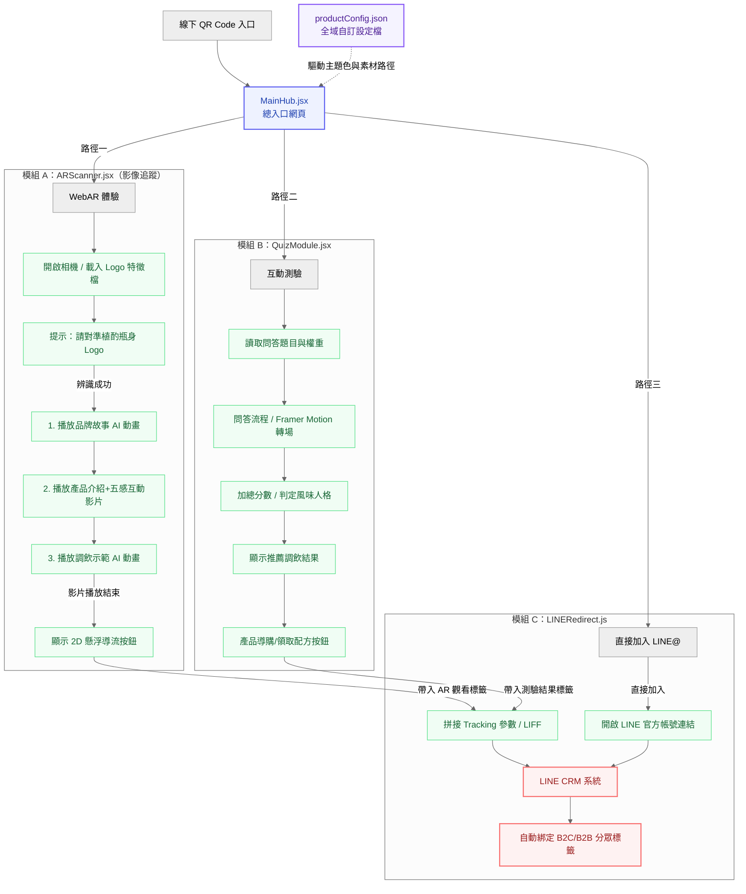

# Project Plan: 通用型模組化產品體驗中心 (Modular Product Experience Hub)

本文件定義了「通用型模組化產品體驗系統」的架構、流程與實作路徑。本專案依據「植酌 Fizz't WebAR 風味互動體驗提案」的核心邏輯進行設計，將原本單次使用的行銷活動網頁轉化為**可重複利用、透過設定檔（JSON）抽換產品內容的範本化系統**。

---

## 🛠️ 技術選型 (Tech Stack)

* **前端框架 (Framework)**: React 18+ + Tailwind CSS (元件化、高度解耦、動態主題色注入架構)
* **動態特效 (Animation)**: Framer Motion (負責 2D UI 滑動、翻頁等流暢轉場與問答動畫)
* **AR 引擎 (AR Engine)**: MindAR.js / A-Frame (封裝為獨立的 React Canvas 元件，支援網頁端圖像追蹤與 WebAR 影片疊加)
* **狀態管理 (State)**: Zustand (輕量化管理全域主題、設定檔載入狀態與使用者測驗得分)
* **資料驗證 (Validation)**: Zod (用於在前端 runtime 嚴格檢查 JSON 設定檔結構，防止白屏)

---

## 📊 系統架構與業務流程圖 (System Flow)

